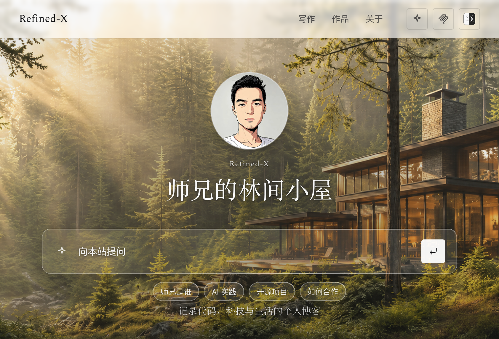
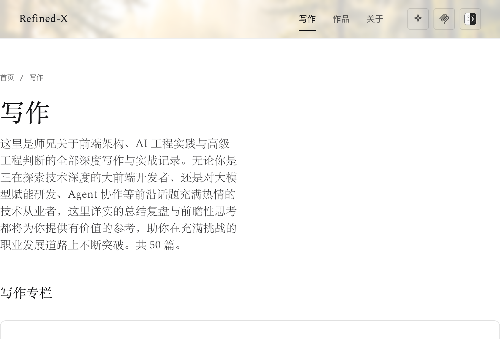

English | [简体中文](README.zh-CN.md)

# Refined-X



An **agent-friendly personal site** template built on [Astro](https://astro.build/) + [Starlight](https://starlight.astro.build/).

- Clean reading experience;
- Fully data-driven content stack;
- Configurable content, output, and config directories — ready for personal data vault integration;
- Auto-generates `llms.txt`, OpenAPI, JSON APIs, and Markdown mirrors;
- Agent-friendly MCP discovery endpoints;
- `/ask` page compatible with the NLWeb protocol.

## Quick start

This repo is a [GitHub template](https://github.com/tower1229/Refined-X) — use **Use this template** on GitHub, or:

```sh
npm create astro@latest -- --template tower1229/Refined-X
cd <project>
npm install
npm run dev
```

Or clone this repo:

```sh
git clone git@github.com:tower1229/Refined-X.git
cd Refined-X
npm install
npm run dev
```

Open the local URL printed in the terminal. Sample content lives in `content/`; static assets in `public/`.

```sh
npm run build && npm run verify
```

## Content schema

Point `contentRoot` at a directory that follows this shape (default `./content`):

```text
content/
  articles/**/*.md      # contentType: article + pubDate + slug + llmSummary
  answers/**/*.md       # contentType: answer + question + shortAnswer
  pages/**/*.md         # contentType: page (e.g. friends)
  profile/
    person.yaml         # kind: person
    cooperation.yaml    # kind: cooperation
    resume.md           # about body
  projects/*.{yaml,yml,json}
  series/
    series.json         # { "order": ["…"] }
    *.yaml
```

The schema is **opinionated**; the **location** of the content tree is configurable.

## Config reference

Edit [`site.config.mjs`](site.config.mjs), or place an overlay at `../instance.config.mjs` (when this package is used as a git submodule) / set the `REFINED_X_INSTANCE_CONFIG` environment variable.

| Field | Default | Purpose |
|-------|---------|---------|
| `locale` | `en` | UI language pack (`en` \| `zh-CN`) |
| `contentRoot` | `./content` | Public Markdown/YAML root |
| `publicDir` | `./public` | Static assets (copied to dist) |
| `outDir` | `./dist` | Build output |
| `assetSource` | unset | Optional image library for `collect-assets` |
| `site` / `title` | example.com / Refined-X | Site identity |
| `ask.askUrl` / `mcpUrl` / `healthUrl` | empty | Optional Public Ask / NLWeb worker |
| `redirects` | `{}` | Astro redirects |
| `brand.*` | Demo Author copy | Identity & content (persona, headings, chips) — not UI chrome |

Relative paths resolve from this package root.

## Capability matrix

| Capability | Included | Notes |
|------------|----------|-------|
| Editorial UI + theme toggle | Yes | See `DESIGN.md` |
| Articles / series / projects / about | Yes | From `contentRoot` |
| Curated Answers + static Ask search | Yes | `/ask`, `/answers` |
| `llms.txt` / `llms-full.txt` / `.md` mirrors | Yes | Generated at build time |
| `/api/*.json` + `/openapi.json` | Yes | Generated at build time |
| `/.well-known/mcp/*` discovery | Yes | URLs may be empty until `ask.*` is configured |
| NLWeb `POST /ask` + MCP tool | Optional | Deploy a Public Ask worker and set `ask.*` |

Sample demo (Themes Portal): [demo.refined-x.com](https://demo.refined-x.com).  
Example in the wild: [refined-x.com](https://refined-x.com).



### Themes Portal short description

> Agent-friendly personal site starter (Astro + Starlight): opinionated public content schema, editorial reading experience, `llms.txt` / OpenAPI / JSON APIs, MCP discovery, and an optional NLWeb Public Ask worker.

Demo hosting: GitHub Pages + `demo.refined-x.com` — see [`deploy/README.md`](deploy/README.md).

### create-astro smoke

```sh
npm create astro@latest -- --template tower1229/Refined-X
# expects default branch `main`
cd <project> && npm install && npm run build && npm run verify
```

Optional live Ask backend example: [`examples/public-ask-worker`](examples/public-ask-worker).

## Use as a submodule

In a parent monorepo (e.g. a vault that owns `20_Publish/`):

```sh
git submodule add git@github.com:tower1229/Refined-X.git 90_Website/Template
```

Add `90_Website/instance.config.mjs` next to the submodule to set `contentRoot` / `publicDir` / `outDir` / brand / ask URLs. Do not change files inside the submodule working tree for instance-specific settings.

## License

MIT
