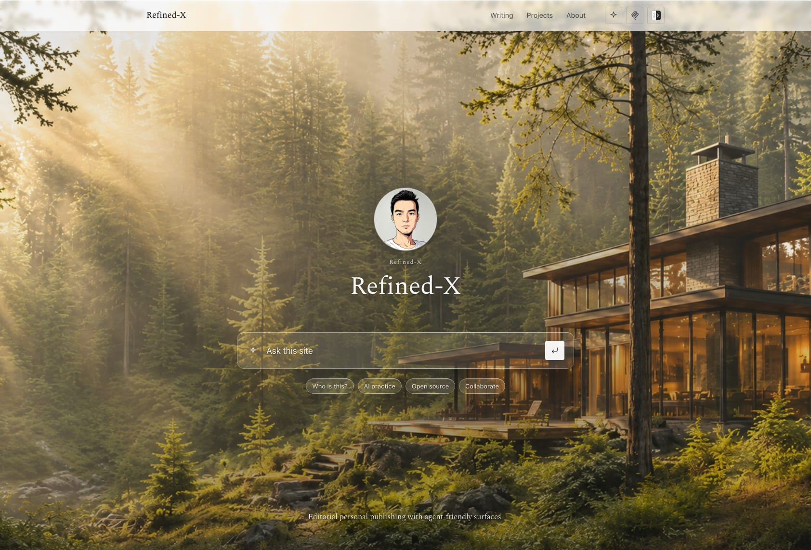
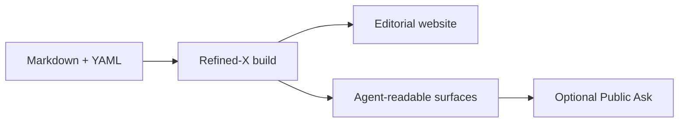

English | [简体中文](README.zh-CN.md)

# Refined-X

## Your public interface for the agentic web

Publish once for people, search engines, and AI agents.

Refined-X is an opinionated personal publishing starter built with
[Astro](https://astro.build/) and [Starlight](https://starlight.astro.build/).
Write in Markdown and YAML; Refined-X turns the same public corpus into:

- a calm, editorial website for human readers;
- Markdown mirrors, `llms.txt`, and structured JSON for language models;
- OpenAPI and MCP discovery metadata for programmatic clients;
- an optional NLWeb-compatible Ask service for live, grounded Q&A.

Your content stays in your own repository or knowledge vault. The site is
static by default, and the AI service is optional.

[Live demo](https://demo.refined-x.com) ·
[Ask the demo](https://demo.refined-x.com/ask/) ·
[Use this template](https://github.com/new?template_name=Refined-X&template_owner=tower1229) ·
[Production example](https://refined-x.com)



## Why Refined-X?

Most personal sites publish HTML and stop there. That works for browsers, but
agents must still extract meaning from navigation, layout, and scripts.

Refined-X publishes one source corpus through three surfaces:

| Surface          | What it provides                                                        |
| ---------------- | ----------------------------------------------------------------------- |
| Human-readable   | Articles, series, projects, profile, answers, topics, light/dark themes |
| Machine-readable | Per-page Markdown, `llms.txt`, `llms-full.txt`, JSON APIs, OpenAPI      |
| Agent-queryable  | Static curated search, optional NLWeb `/ask`, optional MCP `ask` tool   |



## What makes it different

### One corpus, multiple outputs

Articles, answers, projects, series, and public profile data share an explicit
content schema. Refined-X generates the website and every machine-readable
surface from that same source of truth.

### Content independent from the theme

`contentRoot`, `publicDir`, and `outDir` are configurable. Keep a personal
vault or monorepo outside the template, and use Refined-X only as the publishing
layer.

### Useful without an AI backend

The default site is fully static. `/ask` searches curated answers and public
articles without a model, database, or runtime bill.

### Live Q&A when you want it

The optional Public Ask Worker adds grounded retrieval and summarization through
a restricted NLWeb v0.55-compatible `/ask` endpoint and a Streamable HTTP MCP
server. It includes quotas, rate limits, browser verification, source links,
and explicit capability boundaries.

### Designed for reading

Agent support is not allowed to turn the site into a dashboard. Refined-X keeps
an editorial, monochrome visual system with restrained motion and accessible
light/dark themes.

## Quick start

This repository is a GitHub template. Select
[Use this template](https://github.com/new?template_name=Refined-X&template_owner=tower1229),
or run:

```sh
npm create astro@latest -- --template tower1229/Refined-X
cd <project>
npm install
npm run dev
```

Then open the local URL printed by Astro.

Before deploying:

```sh
npm run check
npm run test:public-ask
npm run test:related
npm run build
npm run verify
```

## Choose a deployment mode

| Mode                    | Infrastructure                                              | Result                                                                             |
| ----------------------- | ----------------------------------------------------------- | ---------------------------------------------------------------------------------- |
| Static                  | GitHub Pages, Cloudflare Pages, Netlify, or any static host | Website, local Ask search, Markdown, `llms.txt`, JSON, OpenAPI, discovery metadata |
| Static + external vault | Static host plus an external `contentRoot`                  | Same outputs while content remains outside the template                            |
| Live Ask                | Static site plus the reference Cloudflare Worker            | Grounded browser answers, NLWeb `/ask`, MCP `ask`, health endpoint                 |

Start static. Add Live Ask only when conversational access is useful.

## Deploy static site

| Path | Guide |
| ---- | ----- |
| GitHub Pages | Copy [`deploy/user-github-pages.yml`](deploy/user-github-pages.yml) → enable Pages (GitHub Actions) |
| Cloudflare Pages | Build `npm run build`, output `dist`, Node `24` |

Step-by-step: [`docs/deploy-static.md`](docs/deploy-static.md).

Cloudflare Pages: connect the repo in the [dashboard](https://dash.cloudflare.com/) ([git integration docs](https://developers.cloudflare.com/pages/get-started/git-integration/)). GitHub Pages: copy the workflow linked above.

## Content model

The default public corpus lives in `content/`:

```text
content/
  articles/**/*.md
  answers/**/*.md
  pages/**/*.md
  profile/
    person.yaml
    cooperation.yaml
    resume.md
  projects/*.{yaml,yml,json}
  series/
    series.json
    *.yaml
```

Article frontmatter is intentionally explicit:

```yaml
---
title: Building for humans and agents
description: A short description for readers and search engines.
contentType: article
pubDate: 2026-07-01
slug: humans-and-agents
series: notes
tags:
  - publishing
  - agents
llmSummary: A concise, evidence-grounded summary for machine-readable outputs.
---
```

The schema validates required dates, slugs, summaries, answer fields, and
content types during the build.

## Configure your site

For most installations, create an `instance.config.mjs` overlay. You can also
edit the defaults in [`site.config.mjs`](site.config.mjs):

```js
export default {
  site: "https://example.com",
  title: "Your Name",
  locale: "en",
  timeZone: "UTC",
  contentRoot: "./content",
  publicDir: "./public",
  outDir: "./dist",
  brand: {
    persona: "Your Name",
    homeHeading: "Your Name",
    homeLede: "What you publish and why it matters.",
  },
};
```

Common options:

| Field         | Default     | Purpose                                   |
| ------------- | ----------- | ----------------------------------------- |
| `locale`      | `en`        | UI language pack: `en` or `zh-CN`         |
| `contentRoot` | `./content` | Public Markdown/YAML corpus               |
| `publicDir`   | `./public`  | Static assets                             |
| `outDir`      | `./dist`    | Build output                              |
| `assetSource` | unset       | Optional external image library           |
| `brand.*`     | demo values | Public identity and home-page copy        |
| `ask.*`       | empty       | Optional Public Ask, MCP, and health URLs |

Relative paths resolve from the Refined-X package root.

## Agent-readable surfaces

Every build exposes a predictable public interface:

| Endpoint                            | Purpose                                         |
| ----------------------------------- | ----------------------------------------------- |
| `/llms.txt`                         | Compact site map and important links for agents |
| `/llms-full.txt`                    | Full public text corpus                         |
| `/<page>.md`                        | Clean Markdown mirror of a public page          |
| `/api/profile.json`                 | Structured public identity                      |
| `/api/articles.json`                | Article catalog                                 |
| `/api/topics.json`                  | Topic catalog                                   |
| `/api/search-index.json`            | Static Ask/search corpus                        |
| `/openapi.json`                     | API and optional Ask/MCP contract               |
| `/.well-known/about.json`           | Site capability summary                         |
| `/.well-known/mcp/catalog.json`     | MCP discovery catalog                           |
| `/.well-known/mcp/server-card.json` | MCP server metadata                             |

These endpoints make the site easier to ingest and connect. They do not assume
that every agent automatically discovers or invokes them.

## Enable Live Ask

Optional Cloudflare Worker for grounded browser answers, NLWeb `POST /ask`, and
MCP `ask`. Package: [`examples/public-ask-worker`](examples/public-ask-worker).

**Deploy checklist and troubleshooting:** [`docs/deploy-live-ask.md`](docs/deploy-live-ask.md).

After the Worker is up, point the static site at it:

```js
export default {
  ask: {
    askUrl: "https://ask.example.com/ask",
    mcpUrl: "https://ask.example.com/mcp",
    healthUrl: "https://ask.example.com/health",
  },
};
```

Set `PUBLIC_TURNSTILE_SITE_KEY` at Astro build time when using browser generation.
The hosted demo uses `https://ask-demo.refined-x.com/mcp`.

Live Ask intentionally does not support long-term memory, arbitrary actions,
elicitation, or impersonating the site owner.

## Use an external vault

Refined-X can live as a submodule inside a personal data repository:

```sh
git submodule add git@github.com:tower1229/Refined-X.git 90_Website/Template
```

Place `instance.config.mjs` next to the submodule, or set
`REFINED_X_INSTANCE_CONFIG`:

```js
export default {
  contentRoot: "../../20_Publish",
  publicDir: "../../30_Assets/Public",
  outDir: "../../dist",
};
```

Instance-specific settings stay outside the template, so upstream updates do
not overwrite your identity or content.

## Design

See [`DESIGN.md`](DESIGN.md) for the visual system, typography, component
rules, motion boundaries, and accessibility guidance.


## Scope

Refined-X is:

- a static-first personal publishing starter;
- an opinionated public content schema;
- a reference implementation for agent-readable and agent-queryable surfaces.

Refined-X is not:

- a hosted CMS;
- a private personal agent;
- a long-term memory service;
- a promise of automatic MCP discovery in every client.

## Contributing

Issues, implementation reports, documentation improvements, and pull requests
are welcome. If you launch a site with Refined-X, open a showcase issue so it
can be included in the community gallery.

- [Contributing guide](CONTRIBUTING.md)
- [Changelog](CHANGELOG.md)
- [Security policy](SECURITY.md)
- [Roadmap](ROADMAP.md)

## License

[MIT](LICENSE)
