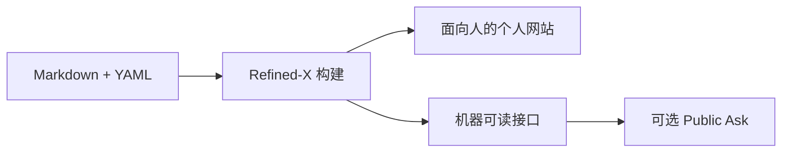

[English](README.md) | 简体中文

# Refined-X

## 面向 Agentic Web 的个人公开接口

一次发布，同时服务于人、搜索引擎与 AI Agent。

Refined-X 是一个基于 [Astro](https://astro.build/) 和 [Starlight](https://starlight.astro.build/) 构建的 AI 友好型个人博客模板。
你只需要用 Markdown 和 YAML 维护公开内容，Refined-X 就能把同一份内容转换为：

- 面向读者的克制、清晰的个人网站；
- 面向大语言模型的 Markdown 镜像、`llms.txt` 与结构化 JSON；
- 面向程序和 Agent 的 OpenAPI、MCP 发现信息；
- 可选的 NLWeb Public Ask 服务，用于实时、基于公开内容的问答。

你的内容可以保存在自己的仓库或独立知识库中。网站默认是纯静态的，
AI 问答服务始终是可选项。

[在线演示](https://demo.refined-x.com) ·
[询问 Demo](https://demo.refined-x.com/ask/) ·
[使用此模板](https://github.com/new?template_name=Refined-X&template_owner=tower1229) ·
[生产站点](https://refined-x.com)


## 为什么需要 Refined-X？

大多数个人网站发布 HTML 后便止步于此。这对浏览器足够友好，
但 AI Agent 仍然需要从导航、布局和脚本中重新提取信息、判断结构和理解语义。

Refined-X 将同一份公开内容发布为三种界面：

| 界面       | 提供的能力                                                      |
| ---------- | --------------------------------------------------------------- |
| 面向人     | 文章、系列、项目、个人资料、精选回答、主题聚合、明暗主题        |
| 面向机器   | 页面级 Markdown、`llms.txt`、`llms-full.txt`、JSON API、OpenAPI |
| 面向 Agent | 静态精选搜索、可选 NLWeb `/ask`、可选 MCP `ask` 工具            |



## Refined-X 有什么不同？

### 一份内容，多种输出

文章、回答、项目、系列与公开个人资料使用明确的内容模型。
网站页面和所有机器可读接口都由这份公开内容生成，
避免为人和 Agent 分别维护两套数据。

### 内容与模板相互独立

`contentRoot`、`publicDir` 和 `outDir` 均可配置。
你可以把个人内容长期保存在独立知识库或 monorepo 中，
仅将 Refined-X 作为可替换的发布层。

### 不接入 AI 后端也能完整使用

默认站点完全静态。`/ask` 可以直接搜索精选回答和公开文章，
不依赖模型、数据库或常驻服务器，也不会产生推理费用。

### 需要时再启用实时问答

可选的 Public Ask Worker 提供基于公开内容的检索和摘要，
暴露受限的 NLWeb v0.55 兼容 `/ask` 接口与 Streamable HTTP MCP 服务，
并内置配额、限流、浏览器验证、来源链接和明确的能力边界。

### 为阅读而设计

对 Agent 友好不意味着把个人网站做成控制台。
Refined-X 使用克制的编辑式视觉语言、适度动效和无障碍明暗主题，
让人的阅读体验始终处于首位。

## 快速开始

本仓库已经启用 GitHub Template。你可以点击
[使用此模板](https://github.com/new?template_name=Refined-X&template_owner=tower1229)，
也可以运行：

```sh
npm create astro@latest -- --template tower1229/Refined-X
cd <project>
npm install
npm run dev
```

然后打开 Astro 在终端中输出的本地地址。

部署前建议依次执行：

```sh
npm run check
npm run test:public-ask
npm run test:related
npm run build
npm run verify
```

## 选择部署模式

| 模式                  | 所需基础设施                                           | 获得的能力                                                          |
| --------------------- | ------------------------------------------------------ | ------------------------------------------------------------------- |
| 纯静态                | GitHub Pages、Cloudflare Pages、Netlify 或任意静态托管 | 网站、本地 Ask 搜索、Markdown、`llms.txt`、JSON、OpenAPI 与发现信息 |
| 静态站点 + 外部知识库 | 静态托管加独立 `contentRoot`                           | 在内容保留于外部知识库的同时获得全部静态输出                        |
| Live Ask              | 静态站点加参考 Cloudflare Worker                       | 基于公开内容的浏览器问答、NLWeb `/ask`、MCP `ask` 与健康检查        |

建议先从纯静态模式开始，只在确实需要对话式访问时启用 Live Ask。

## 部署静态站点

| 路径 | 说明 |
| ---- | ---- |
| GitHub Pages | 复制 [`deploy/user-github-pages.yml`](deploy/user-github-pages.yml) → 启用 Pages（GitHub Actions） |
| Cloudflare Pages | 构建命令 `npm run build`，输出目录 `dist`，Node `24` |

完整步骤见 [`docs/deploy-static.md`](docs/deploy-static.md)。

Cloudflare Pages：在[控制台](https://dash.cloudflare.com/)连接仓库（[Git 集成文档](https://developers.cloudflare.com/pages/get-started/git-integration/)）。GitHub Pages：复制上方 workflow 即可。

## 内容模型

默认公开内容位于 `content/`：

```text
content/
  articles/**/*.md
  answers/**/*.md
  pages/**/*.md
  profile/
    person.yaml
    cooperation.yaml
    resume.md
  projects/*.{yaml,yml,json}
  series/
    series.json
    *.yaml
```

文章 frontmatter 使用明确、可验证的字段：

```yaml
---
title: 为人和 Agent 同时构建个人网站
description: 一段面向读者和搜索引擎的简短描述。
contentType: article
pubDate: 2026-07-01
slug: humans-and-agents
series: notes
tags:
  - publishing
  - agents
llmSummary: 一段供机器读取、忠于正文事实的简明摘要。
---
```

构建时会校验必要日期、slug、摘要、回答字段和内容类型，
使公开语料保持稳定且可被程序处理。

## 配置站点

多数情况下，建议创建一个 `instance.config.mjs` 覆盖实例配置。
你也可以直接修改 [`site.config.mjs`](site.config.mjs) 中的默认值：

```js
export default {
  site: "https://example.com",
  title: "你的名字",
  locale: "zh-CN",
  timeZone: "Asia/Shanghai",
  contentRoot: "./content",
  publicDir: "./public",
  outDir: "./dist",
  brand: {
    persona: "你的名字",
    homeHeading: "你的名字",
    homeLede: "你关注什么，以及为什么写作。",
  },
};
```

常用配置：

| 字段          | 默认值      | 用途                                  |
| ------------- | ----------- | ------------------------------------- |
| `locale`      | `en`        | 界面语言，可选 `en` 或 `zh-CN`        |
| `contentRoot` | `./content` | 公开 Markdown/YAML 内容目录           |
| `publicDir`   | `./public`  | 静态资源目录                          |
| `outDir`      | `./dist`    | 构建输出目录                          |
| `assetSource` | 未设置      | 可选的外部图片资源库                  |
| `brand.*`     | Demo 数据   | 公开身份与首页文案                    |
| `ask.*`       | 空          | 可选的 Public Ask、MCP 与健康检查地址 |

相对路径均从 Refined-X 包根目录解析。

## Agent 可读接口

每次构建都会生成一组可预测的公开接口：

| 地址                                | 用途                                |
| ----------------------------------- | ----------------------------------- |
| `/llms.txt`                         | 面向 Agent 的精简站点地图与重要链接 |
| `/llms-full.txt`                    | 完整公开文本语料                    |
| `/<page>.md`                        | 对应公开页面的纯净 Markdown 镜像    |
| `/api/profile.json`                 | 结构化公开身份信息                  |
| `/api/articles.json`                | 文章目录                            |
| `/api/topics.json`                  | 主题目录                            |
| `/api/search-index.json`            | 静态 Ask 与搜索语料                 |
| `/openapi.json`                     | API 以及可选 Ask/MCP 契约           |
| `/.well-known/about.json`           | 站点能力摘要                        |
| `/.well-known/mcp/catalog.json`     | MCP 发现目录                        |
| `/.well-known/mcp/server-card.json` | MCP 服务元数据                      |

这些接口可以降低网站被检索、摄取和连接的成本，
但不承诺所有 Agent 都会自动发现或主动调用它们。

## 启用 Live Ask

可选的 Cloudflare Worker，用于带来源的浏览器问答、NLWeb `POST /ask` 与 MCP `ask`。
包目录：[`examples/public-ask-worker`](examples/public-ask-worker)。

**部署清单与故障排查：** [`docs/deploy-live-ask.md`](docs/deploy-live-ask.md)。

Worker 上线后，在静态站点配置中接入：

```js
export default {
  ask: {
    askUrl: "https://ask.example.com/ask",
    mcpUrl: "https://ask.example.com/mcp",
    healthUrl: "https://ask.example.com/health",
  },
};
```

若启用浏览器生成式回答，请在 Astro 构建时设置 `PUBLIC_TURNSTILE_SITE_KEY`。
官方 Demo 使用 `https://ask-demo.refined-x.com/mcp`。

Live Ask 有意不支持长期记忆、任意外部操作、动态权限征询，
也不会模仿或冒充网站所有者。

## 使用外部知识库

Refined-X 可以作为子模块放入个人数据仓库：

```sh
git submodule add git@github.com:tower1229/Refined-X.git 90_Website/Template
```

将 `instance.config.mjs` 放在子模块附近，或设置
`REFINED_X_INSTANCE_CONFIG`：

```js
export default {
  contentRoot: "../../20_Publish",
  publicDir: "../../30_Assets/Public",
  outDir: "../../dist",
};
```

个人身份和实例配置保留在模板之外，
因此更新 Refined-X 时不会覆盖你的内容与个性化信息。

## 设计

视觉系统、字体、组件规则、动效边界和无障碍说明详见
[`DESIGN.md`](DESIGN.md)。


## 项目边界

Refined-X 是：

- 一个静态优先的个人发布模板；
- 一套观点明确的公开内容模型；
- 一份同时面向人、机器与 Agent 的公开接口参考实现。

Refined-X 不是：

- 托管式 CMS；
- 私人 Agent；
- 长期记忆服务；
- 对所有 MCP 客户端自动发现能力的承诺。

它服务的是“个人愿意公开表达和被外部读取的部分”，
而不是替个人保存全部私人数据或代表个人执行任意行动。

## 参与贡献

欢迎提交 Issue、部署案例、文档改进和 Pull Request。
如果你已经使用 Refined-X 发布了自己的站点，
可以创建 showcase Issue，帮助其他人了解真实使用方式。

- [贡献指南](CONTRIBUTING.md)
- [更新日志](CHANGELOG.md)
- [安全策略](SECURITY.md)
- [路线图](ROADMAP.md)

## 开源许可

[MIT](LICENSE)
